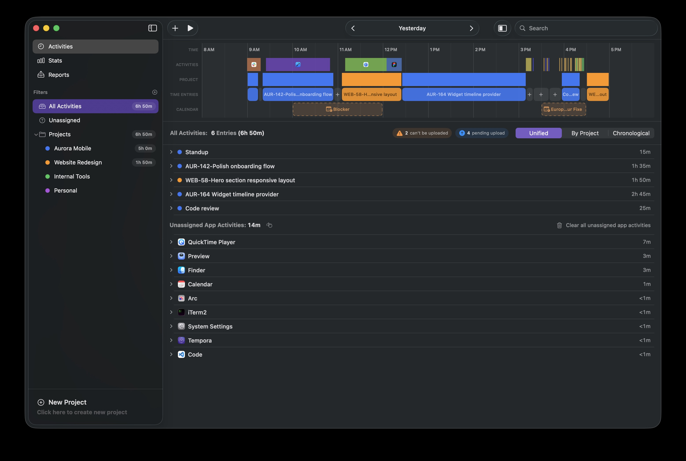

# Tempora — Releases

**A native macOS app for organizing and managing your time.**

Tempora turns the hours you actually work into clean, organized records — with almost no manual bookkeeping. It runs as both a main window and a menu-bar app, tracks the apps and windows you use automatically, lays your day out on a visual color-coded timeline, and can push tracked time straight to Jira issues as worklogs. Your data stays on your Mac.

This repository hosts the official release downloads and the auto-update feed.

## Download

**[⬇ Download Tempora 0.2.1 (.dmg)](https://raw.githubusercontent.com/Tempora-Time-Tracking/tempora-releases/main/0.2.1/Tempora-0.2.1.dmg)**

Requires **macOS 15 (Sequoia) or later**. The app is signed with a Developer ID and notarized by Apple.

## Install

1. Open the downloaded `Tempora-0.2.1.dmg`.
2. Drag **Tempora** onto the **Applications** shortcut in the same window.
3. Launch Tempora from Applications.

On first run, Tempora asks for **Accessibility** permission — this powers the automatic activity tracking (which apps and windows you're using). Optional features request their own permissions when you enable them: browser-tab tracking (Automation), calendar overlay (Calendars), and Jira reminders (Notifications).

## Updates

Tempora updates itself: it checks this repository's feed in the background and offers new versions in-app. You can check manually anytime via **Tempora → Check for Updates…** in the menu bar. There's no need to come back to this page.

## What's in this repository

| File | Purpose |
|---|---|
| `<version>/Tempora-<version>.dmg` | Installer image — what you download |
| `<version>/Tempora-<version>.zip` | Update archive consumed by the in-app updater |
| `appcast.xml` | The [Sparkle](https://sparkle-project.org) update feed |
